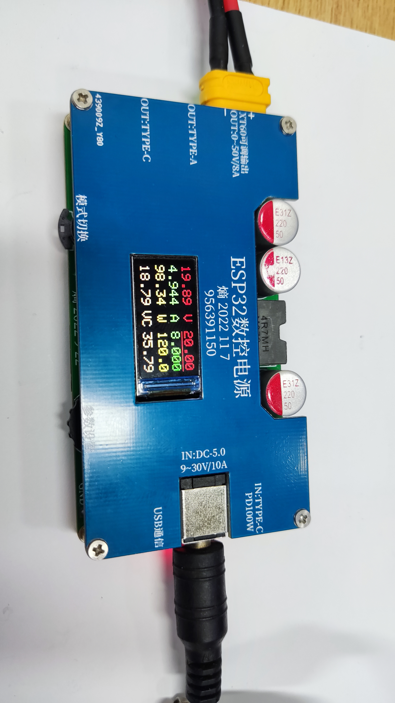
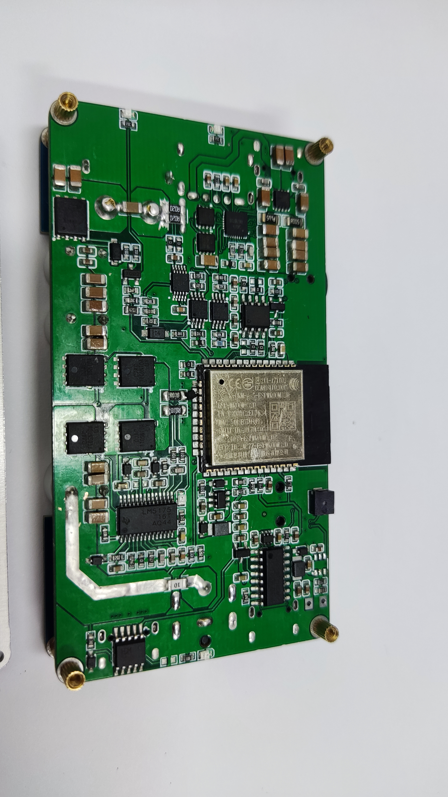
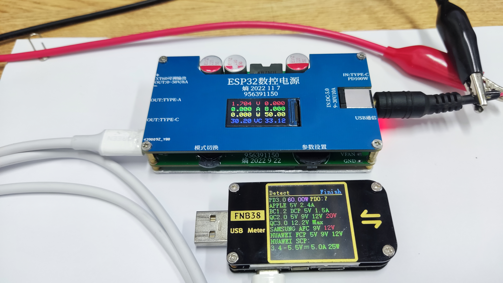
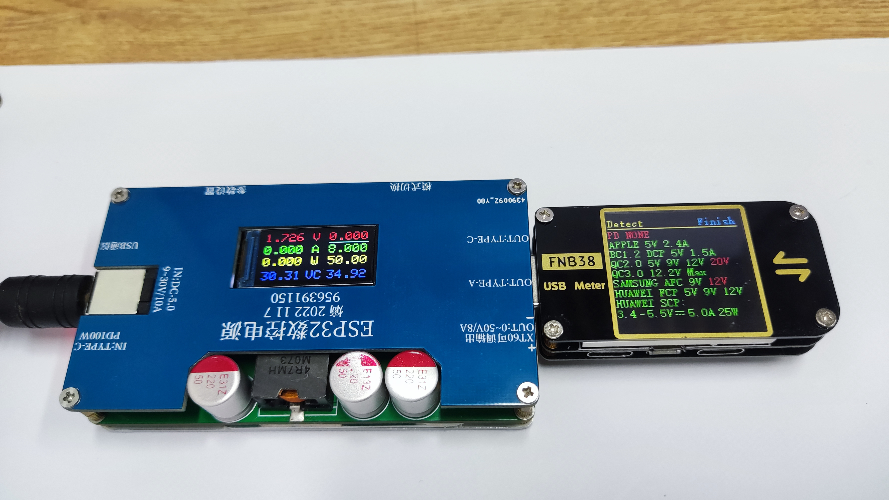

# ESP32 数控电源

 **ESP32数控电源 基于ESP32和升降压芯片构建的一个便携数控可调稳压电源 通过TM8211DAC芯片和运放控制LM5175升降压芯片反馈脚上的采样电压信号实现输出电压控制 并通过INA226进行电压电流采样 在由ESP32进行控制和驱动TFT显示参数    快充输出由SW3516H独立控制TYPE-C和TYPE-A （100W）两路快充接口自动识别输出** 

1.  DC接口输入支持 9~30V/1-8A 输入   两路输入接口只能 二选一使用  而且输入功率必须>输出功率 
2.  TYPE-C输入由CH224K快充诱骗 最大到PD100W (20V/5A ) 输入  还支持QC等常用协议
3  USB通信TYPE-C 输入接口只用于串口通信和一键程序下载烧录 
4.  XT60端口可调输出  2.5~50V/0~8A（极限120W）常规散热默认50W输出 
5.  TYPE-C和TYPE-A 接口输出功率最大100W（VIN>28V） 两路快充接口自动识别输出
6.  显示参数用ST7735  0.96寸 TFT 80*160 RGB显示屏 
7.  旋转编码器和多功能按键进行参数设置和功能切换
8.  支持NTC测温和输入电压测量   预留散热风扇电源接口

#### 可调输出详细参数
1. 电压输出范围：2.5V~50V    因为输出PMOS开关的开启阈值电压和LM5175的反馈电压影响导致只能最低输出2.5V的电压
2. 电压输出精度：20mV
3. 电压测量精度：10mV
4. 电压调整步进：1mV

1. 电流输出范围：0~8A       最大输出8A是基于散热考虑实际电流还可以再加 但需要调整分流电阻值 
2. 电流测量精度：大约1mA
3. 电流调整步进：1mA

1. 输出功率范围：0~120W  常规散热默认50W  如果要长时间大功率的使用一定要做好散热 必须进行强制风冷
2. 功率测量精度：10mW
3. 功率调整步进：1mW

#### 基础功能模式
1. 主要功能模式：详细显示模式  简易显示模式  参数校准模式 通过多功能按键 右键切换   长按右键切换显示方向
2. 设定参数择选：电压 电流  功率  校准开关等通过 多功能按键左键切换
3. 参数设置模式：通过旋转编码器中键选择设定的位数  左右拨动编码器进行数值加减
4. 可调输出开关：在显示模式通过多功能按键 中键切换PMOS开关
5. 校准择选模式：多功能按键左键切换要校准的电压电流 并通过参数设置输入基准参数后调到校准显示并按下多功能按键 中键进行校准
6. 恒流保护模式：当输出电流大于设定电流时将进入恒流状态 电流恒定电压拉低  但是硬件恒流控制效果不是很好设备回处在打嗝状态
7. 过流保护模式：当输出电流大于设定电流时将关闭输出
8. 其他保护模式：当输出功率大于设定功率或温度超过50°时关闭输出
 
#### 程序下载
1. 程序基于Arduino IDE 开发 并把相关库添加好 数据线接好  选择EAP32 和对应串口编译上传即可
2. 有两个版本的程序 3.0 和3.1版   3.0版的 电流保护 模式是实际电流超过设定电流关断输出开关
3. 3.1版的 恒流保护 模式是实际电流超过设定电流 启动DAC恒流控制 但恒流控制效果不是很好 而且硬件恒流电路可能会影响最大电流输出
4. 程序和功能都不是很完善 等以后有空可能升级下  程序和依赖库在附件内
 
#### 注意事项
1. PCB 打样4层 长90mm 宽49mm  板厚1.6mm  元件参数以原理图为准 嘉立创没有的元件上淘宝   相关软硬件资料都在附件内
2. ESP32数控电源主要由主控PCBA 和PCB外壳及M2铜柱螺丝组成   整机大概 长90mm 宽49mm  高20mm
3. 有两个不同版本的PCB外壳 看个人选择使用  最好使用铝基板并用导热硅胶垫紧密贴在功率MOS和铝基板间辅助散热
4. 如果需要长时间大功率的使用一定要做好散热 最好能进行强制风冷 硬件上有预留这功能但我开发
5. 用于电压电流采样的分压电阻 分流电阻都有一定的误差  第一次使用前都要用外部高精度电压表和恒流负载进行校准 无精度要求可以不用
6. 该数控电源项目并不完美 还有一些的问题  开源出来就是希望和大家一起完善让每个人都能用上强大廉价的数控电源

#### 其他平台
1. 立创开源平台：https://oshwhub.com/FJ956391150/esp32-shuo-kong-dian-yuan

